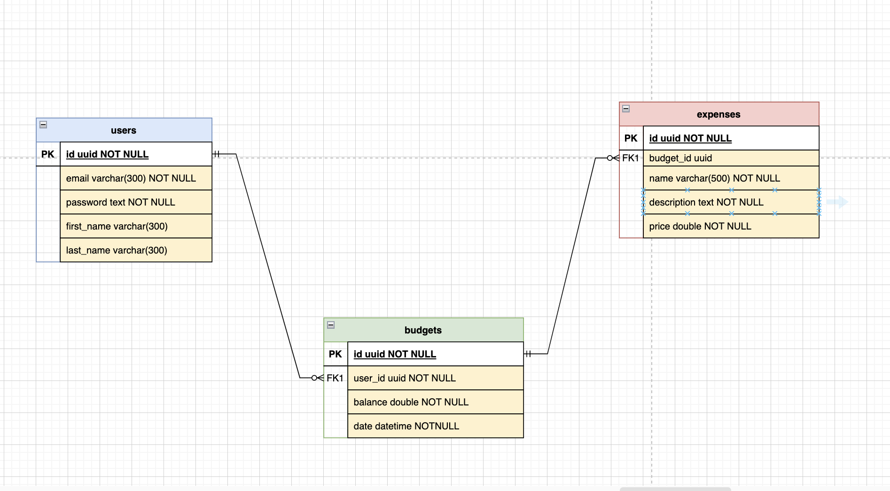
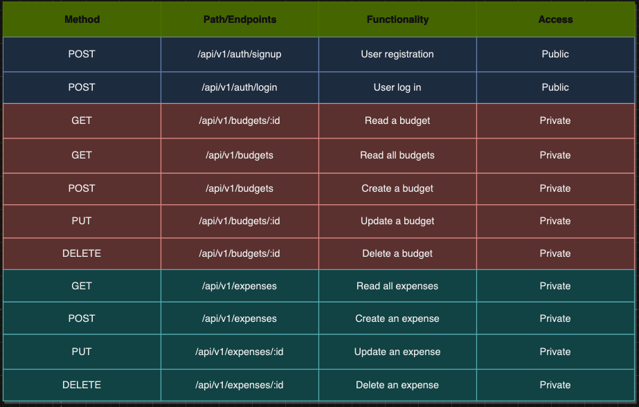

# Description

Budgeteer is a budget app designed to allow people to take control of their finances. With Budgeteer, users can create custom budget categories and add expenses to these categories, allowing them to  monitor their income, expenses, and financial goals.

# Planning and Approach
- The first day of the project was spent planning. We began by creating user stories, an ERD, and listing our endpoints out. We knew that we wanted to configure our security first before creating our models and classes. Therefore, most of the next day was spent with security configuration together using a driver/navigator method. After configuring our approach to which models to implement, we decided on which roles each team member was going to tackle. The next 2 days were the most challenging days and were spent configuring our test classes and ensuring they ran seamlessly.  

- To keep merge conflicts minimal, we divided the workload by classes, and each morning we would resolve pull requests and merge conflicts together to ensure we started the day with no merge conflicts. This approach worked in our favor and we were able to keep merge conflicts to a minimum.

### Budgeteer ERD

### Endpoints

# Hurdles
- **Test classes:** Creating our testing classes took us about 4 days (including the weekend). We had a mixture of highly experienced and less experienced teammates, so it was important to allow the less experienced teammates to use this project to strengthen their weaker areas, and to learn to lean on more senior teammates for support and assistance in debugging.  

- **Merge conflicts:** Throughout the development process, our team encountered merging conflicts. Such conflicts arose when we provided guidance to one another on coding solutions, leading to implementations that occasionally resulted in similar or conflicting code in separate branches. Nevertheless, our well-structured workload distribution and effective collaboration, we promptly resolved these conflicts.  

- **Model Configuration conflicts:** In accordance with our initial project plan, we contemplated the inclusion of a 'Category' model to serve as a repository for diverse expense types. Our initial design envisioned that expenses would be associated with specific categories, and these categories would, in turn, be linked to individual users. However, following a comprehensive review and based on guidance from our instructors, we made the strategic decision to streamline our data model. Consequently, we opted to eliminate the additional 'Category' model in favor of a simplified architecture. Our revised approach now features an 'Expense' model directly associated with user-specific monthly budget entries, aligning with best practices and ensuring greater efficiency in our application's design. 

# User Stories

### User Authentication

**As a user**, I want to be able to create an account and log in so that I can access my budget and financial data.

**Acceptance Criteria:**
- Users can register with a unique username and a secure password.
- Registered users can log in using their username and password.

### Managing Categories

**As a user**, I want to create a budget category so that I can categorize my expenses effectively.

**Acceptance Criteria:**
- Users can create a budget category by providing a unique category name.
- Category names must be unique for each user.
- Users receive a confirmation message upon successful category creation.

**As a user**, I want the ability to update a budget category's name or details, ensuring accuracy.

**Acceptance Criteria:**
- Users can edit a budget category's name or details.
- Changes to a category's name do not conflict with existing category names.

**As a user**, I want to view the details of a specific budget category.

**Acceptance Criteria:**
- Users can click on a category to view its details, including its name and associated expenses.
- Users are presented with an error message if the category does not exist.

**As a user**, I want to see a list of all my budget categories for an overview.

**Acceptance Criteria:**
- Users can access a list of all their budget categories.
- The list displays category names and, if available, the number of associated expenses.

**As a user**, I want the option to delete a budget category that I no longer need.

**Acceptance Criteria:**
- Users can delete a budget category.
- Deletion of a category should not affect associated expenses.

### Managing expenses

**As a user**, I want to add a budget expense to a specific category to track my expenses accurately.

**Acceptance Criteria:**
- Users can add a budget expense to a category by providing expense details such as name, amount, and description.
- Users receive a confirmation message upon successful expense addition.

**As a user**, I want the ability to update a budget expense's details to ensure they are current.

**Acceptance Criteria:**
- Users can edit a budget expense's name, amount, or description.
- Changes to an expense's name should not conflict with existing expense names within the same category.

**As a user**, I want to view the details of a specific budget expense to track its information.

**Acceptance Criteria:**
- Users can click on an expense to view its details, including name, amount, and description.
- Users are presented with an error message if the expense does not exist.

**As a user**, I want to see a list of all budget expenses within a specific category.

**Acceptance Criteria:**
- Users can access a list of all budget expenses within a category.
- The list displays expense names, amounts, and descriptions, if available.

**As a user**, I want the option to delete a budget expense when it's no longer relevant.

**Acceptance Criteria:**
- Users can delete a budget expense.
- Deletion of an expense should not affect the category or other associated expenses.

# Tools and Technologies Used
- Java
- Springboot
- Postman
- H2
- PostGres
- Drawio
- Spring Initializer

# Dependencies
- [Springboot](https://spring.io/projects/spring-boot)
- [Lombok](https://projectlombok.org/)
- [Mockito](https://site.mockito.org/)
- [JUnit](https://junit.org/junit5/)

# Contributors
- [Kairo Evans](https://github.com/kairoje)
- [Julian Smith](https://github.com/jayastronomic)
- [Elizabeth Yang](https://github.com/lizabawa)

